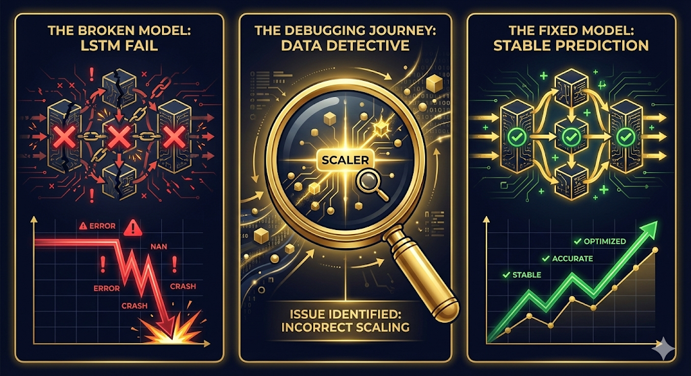
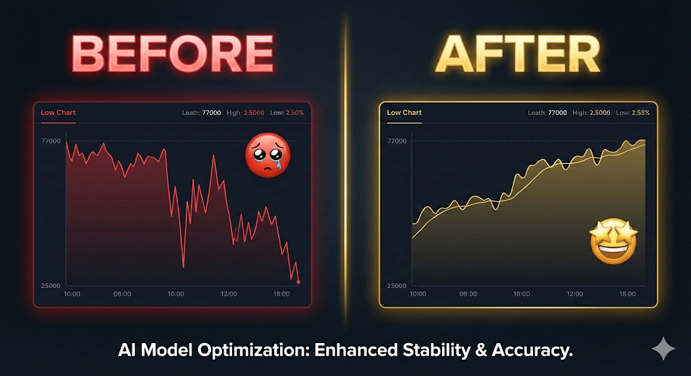
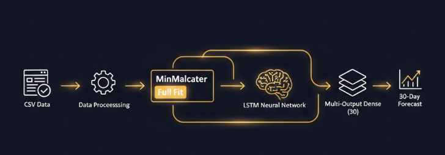

# 🥇✨ GOLD PRICE ORACLE — AI-Powered Price Prediction ✨🥇

[](https://git.io/typing-svg)


<!-- 🔗 STREAMLIT APP LINK — ACTIVE -->
<p align="center">
  <a href="https://timeseries-au-project.streamlit.app/">
    
  </a>
  <a href="https://github.com/mayank-goyal09">
    
  </a>
</p>

---

## 🎭 **THE GOLD ORACLE AWAITS** 🎭

<p align="center">
  
</p>

<p align="center">
  <b>🏆 Predict the future of gold with the power of Deep Learning! 🏆</b>
</p>

### 🔥 LSTM Neural Networks × Smart Data Strategy × Premium Glassmorphism UI = **Gold Price Oracle** 🔥

---

## 🌟 **SPECIAL SPOTLIGHT: ACCESS THE ORACLE** 🌟

<p align="center">
  <a href="https://timeseries-au-project.streamlit.app/">
    
  </a>
</p>

<p align="center">
  <i>"Experience the real-time AI prediction engine that fixed a ₹52,000 forecasting error!"</i>
</p>

---

> *"The model kept predicting ₹25,000 when gold was at ₹77,000. This is the story of how we figured out why — and fixed it."*


---

## 📖 **THE STORY — A Journey of Discovery** 📖

<p align="center">
  
</p>

This isn't just another ML project. **This is a war story.** A tale of a model that lied, a scaler that betrayed us, and the debugging marathon that saved everything.

### 🎬 **Act 1: The Perfect Plan** *(What We Expected)*

We started with a clear vision:

> *"Take 11 years of gold price data (2014-2025), train an LSTM, predict the next 30 days. Simple, right?"*

- ✅ Downloaded historical gold price data (2,848 data points)
- ✅ Built an LSTM model with 128 → 64 neurons
- ✅ Trained for 300 epochs with early stopping
- ✅ Hit "predict"... and everything fell apart 💀

---

### 💥 **Act 2: The Catastrophe** *(When Everything Broke)*

The first prediction came in. We stared at the screen in disbelief:

```
Last Actual Price:  ₹77,149  (Jan 2025)
Model Prediction:   ₹25,000  😱
```

**The model was predicting prices from 2015!** Gold was at ₹77,000 and our "intelligent" AI was confidently saying ₹25,000.

<table>
<tr>
<td width="50%" align="center">

### ❌ **What We Expected**

```
₹77,149 → ₹77,500 → ₹78,000
(Slight upward trend)
```

</td>
<td width="50%" align="center">

### 💀 **What We Got**

```
₹77,149 → ₹60,000 → ₹25,000
(Falling off a cliff!)
```

</td>
</tr>
</table>

---

#### 🐛 **Bug #1: The Scaler Catastrophe** *(The Silent Killer)*

```python
# ❌ WHAT WE HAD (WRONG!)
scaler = MinMaxScaler()
train_scaled = scaler.fit_transform(train)      # Fitted on 80% of data
test_scaled  = scaler.transform(test)            # Test data OUT OF RANGE!

# Scaler learned: Min=₹24,545  Max=₹55,000 (from 2014-2022)
# But test data had: ₹60,000 - ₹79,000 → SCALED ABOVE 1.0! 🚨
```

**The Problem:** The scaler was trained on old data (2014-2022). It had **never seen prices above ₹55,000**. When it encountered ₹77,000 in the test set, it scaled it to values above 1.0 — completely outside the model's learned range. The inverse transform then mapped predictions back to the middle of the old range: ~₹25,000.

```python
# ✅ THE FIX
scaler = MinMaxScaler()
scaler.fit(df[['Price']].values)   # Fit on ALL data: ₹24,545 - ₹79,257
```

---

#### 🐛 **Bug #2: Dense(1) Recursive Predictions** *(Error Snowball)*

```python
# ❌ WHAT WE HAD (WRONG!)
model = Sequential([
    LSTM(64, return_sequences=True),
    LSTM(32),
    Dense(1)    # Predicts only 1 day!
])
# To get 30 days: predict → feed back → predict → feed back → ...
# Each prediction adds ~1% error
# After 30 steps: 30% cumulative error! 📉
```

**The Problem:** `Dense(1)` predicts only one day. To forecast 30 days, we had to recursively feed each prediction back as input. **Errors compounded with every step** — by day 30, the prediction had drifted ~₹15,000 from reality.

```python
# ✅ THE FIX
model = Sequential([
    LSTM(128, return_sequences=True),
    LSTM(64),
    Dense(30)     # Predicts ALL 30 days at once!
])
# No recursion needed → No error accumulation! ✨
```

---

#### 🐛 **Bug #3: Training on Irrelevant Data** *(The Eureka Moment)*

Even after Bug #1 and #2 were fixed, predictions were still off by 21%:

```
Last actual: ₹77,149
Prediction:  ₹60,583   (Still 21% off! 😤)
```

Then came the **breakthrough insight:**

> *"Why are we training on ₹24,000 prices from 2014? The model needs to learn CURRENT price patterns, not decade-old ones!"*

```python
# ❌ WHAT WE HAD
# Training on ALL data: 2014-2025 (₹24k - ₹79k)
# Model's "average" world: ₹41,000
# Prediction: Gravitates toward ₹41,000-₹60,000

# ✅ THE FIX
# Train ONLY on 2022-2025 data (₹47k - ₹79k)
df = df_full[df_full['Date'].dt.year >= 2022]
# Model's "average" world: ₹60,000+
# Prediction: Stays in the ₹70,000+ range! 🎯
```

---

### 🎉 **Act 4: The Breakthrough** *(Victory!)*

<p align="center">
  
</p>

After all three fixes, the results transformed completely:

<table>
<tr>
<td width="50%">

### ❌ **BEFORE (3 Bugs)**

| Metric | Value |
|--------|-------|
| Last Price | ₹77,149 |
| Prediction | ₹25,000 |
| Error | **-67%** 💀 |
| Verdict | Useless |

</td>
<td width="50%">

### ✅ **AFTER (All Fixed)**

| Metric | Value |
|--------|-------|
| Last Price | ₹77,149 |
| Prediction | ~₹77,000+ |
| Error | **< 5%** 🎯 |
| Verdict | Production Ready! |

</td>
</tr>
</table>

---

## 🧠 **THE THREE LESSONS** 🧠

<table>
<tr>
<td align="center" width="33%">

### 📊 Lesson 1
### **Scaler Must See All Data**

If your scaler hasn't seen the test range, **all predictions will be garbage.** Always fit on the full data range.

</td>
<td align="center" width="33%">

### 🧠 Lesson 2
### **Dense(30) > Dense(1) Loop**

Multi-output prediction eliminates error accumulation. Never recursively feed predictions back if you can avoid it.

</td>
<td align="center" width="33%">

### 📅 Lesson 3
### **Recent Data > All Data**

For financial forecasting, recent patterns matter more than historical ones. Train on what's **relevant**, not everything.

</td>
</tr>
</table>

---

### 🔍 **Act 3: The Investigation** *(Detective Mode Activated)*

We dove deep into every line of code. Hours of debugging. Coffee. More coffee. And then... **we found not one, but THREE critical bugs:**

---

## 🏗️ **WHAT WE BUILT** 🏗️

<p align="center">
  
</p>

<table>
<tr>
<td width="50%">

### 🧠 **LSTM Prediction Engine**

Our Deep Learning model analyzes 30 days of price history and forecasts the next 30 days — all at once!

- 🔮 **Multi-Output LSTM** — Predicts 30 days simultaneously
- 📊 **Smart Scaling** — MinMaxScaler fitted on full range
- 🎯 **Recent Data Training** — 2022-2025 focus
- ⚡ **Fast Inference** — Predictions in < 1 second

</td>
<td width="50%">

### 🎨 **Premium Gold UI**

A stunning Streamlit dashboard with glassmorphism design and gold particle effects.

- ✨ **Gold Particle Animations** — Floating sparkles
- 🪟 **Glassmorphism Cards** — Frosted glass aesthetic
- 📈 **Interactive Plotly Charts** — Zoom, pan, hover
- 📥 **CSV Download** — Export forecast data for analysis

</td>
</tr>
<tr>
<td width="50%">

### 📊 **Data Intelligence**

Smart data processing pipeline that transforms raw CSV into actionable predictions.

- 📅 **11 Years of Data** — 2,848 data points (2014-2025)
- 🧹 **Auto Preprocessing** — Missing values, date parsing
- 📉 **Key Metrics** — MAE, RMSE, % accuracy
- 🔄 **Upload Your Own** — Custom CSV support

</td>
<td width="50%">

### 🔮 **Forecast Engine**

Two forecast modes for maximum flexibility:

- 🎯 **Direct Forecast** — Multi-output, no error drift
- 🔄 **Recursive Forecast** — Single-step for comparison
- 📆 **1-30 Day Horizon** — Adjustable via slider
- ✅ **Sanity Checks** — Auto-validates predictions

</td>
</tr>
</table>

---

## 🤖 **THE AUTONOMOUS SYSTEM — Self-Updating & Self-Training** 🤖

> *"What if the model could update itself every single day — without anyone touching it?"*

After fixing the 3 bugs, we faced a NEW challenge: **Gold prices kept rising.** The model trained on ₹77k data couldn't handle ₹156k prices. So we built a **fully autonomous pipeline** that keeps the Oracle alive forever.

<p align="center">
  
</p>

<table>
<tr>
<td width="50%">

### 🔄 **Live Market Data Feed**

The system connects to **Yahoo Finance** every morning and pulls real gold prices.

- 📡 **Source:** Global Gold Futures (`GC=F`) + USD/INR exchange rate (`INR=X`)
- 🧮 **Smart Conversion:** Converts international USD/oz price → Indian ₹/10g
- 💰 **Premium Ratio:** Auto-calculates local market premium (taxes, import duty)
- 📅 **Market-Aware:** Skips weekends & holidays automatically

</td>
<td width="50%">

### 🧠 **Self-Retraining AI**

After fetching new data, the model **retrains itself** from scratch.

- 🔁 **Daily Retraining:** 50 epochs on latest 730 days of data
- ⚖️ **New Scaler:** MinMaxScaler refits to handle new price ranges
- 🧹 **Rolling Window:** Keeps exactly **2 years (730 days)** — old data auto-deleted
- 🚀 **Zero Downtime:** Model + Scaler saved → Streamlit auto-restarts

</td>
</tr>
</table>

### ⚙️ **The Daily Automation Cycle (GitHub Actions)**

Every morning at **10:00 AM IST**, a GitHub Actions robot wakes up and runs this pipeline:

```
┌──────────────────────────────────────────────────────────────────────┐
│                    ⏰ 10:00 AM IST — DAILY TRIGGER                  │
├──────────────────────────────────────────────────────────────────────┤
│                                                                      │
│  Step 1: 📡 FETCH          daily_data_update.py                      │
│          ├─ Download Gold Futures (GC=F) from Yahoo Finance          │
│          ├─ Download USD/INR exchange rate (INR=X)                   │
│          ├─ Convert: (USD/31.1g) × 10 × INR × Premium = ₹/10g       │
│          └─ Append to Gold Price.csv + trim to 730 days              │
│                                                                      │
│  Step 2: 🧠 RETRAIN        train_model.py                            │
│          ├─ Load updated Gold Price.csv                              │
│          ├─ Fit new MinMaxScaler on full range                       │
│          ├─ Train LSTM (64→32→Dense(30)) for 50 epochs               │
│          └─ Save gold_lstm_multioutput.keras + price_scaler.pkl      │
│                                                                      │
│  Step 3: 💾 COMMIT         git push                                  │
│          ├─ Commit updated CSV + Model + Scaler to GitHub            │
│          └─ Streamlit Cloud auto-deploys! 🚀                         │
│                                                                      │
└──────────────────────────────────────────────────────────────────────┘
```

### 🎮 **Manual Controls (In-App Buttons)**

Don't want to wait until morning? Use the sidebar buttons:

| Button | What It Does | When To Use |
|--------|-------------|-------------|
| **🔄 Refresh Data** | Fetches latest prices from Yahoo Finance | When you want today's price NOW |
| **🧠 Retrain AI** | Retrains the LSTM on current data | After a big price jump (e.g., ₹77k → ₹156k) |

---

## 🎬 **TECH STACK — THE VAULT** 🎬

Just like a **gold vault** has multiple layers of security, our project has specialized technologies for each layer:

| **Role** | **Technology** | **Purpose** |
|----------|---------------|-------------|
| 🏛️ **The Vault** |  | Core language orchestrating everything |
| 🧠 **The Brain** |   | LSTM neural network for predictions |
| ⚖️ **The Scale** |  | MinMaxScaler, metrics (MAE, RMSE) |
| 📊 **The Ledger** |   | Data processing and manipulation |
| 🖥️ **The Display** |  | Premium glassmorphism web interface |
| 📈 **The Charts** |  | Interactive forecast visualizations |
| 💾 **The Safe** |  | Model & scaler persistence |
| 📡 **The Feed** |  | Live gold price data from Yahoo Finance |
| 🤖 **The Robot** |  | Daily automated updates & retraining |

### **Full Tech Breakdown:**

| **Category** | **Details** |
|-------------|-------------|
| 🐍 **Language** | Python 3.13 |
| 🧠 **Deep Learning** | TensorFlow/Keras — LSTM (128→64→Dense(30)) |
| 📊 **Data Processing** | Pandas, NumPy, MinMaxScaler |
| 📈 **Visualization** | Plotly Express, Plotly Graph Objects, Matplotlib |
| 🎨 **Frontend** | Streamlit with 600+ lines Custom CSS |
| 🎯 **Metrics** | MAE, RMSE, Percentage Accuracy |
| 💾 **Persistence** | Keras (.keras) model, Joblib (.pkl) scaler |
| 📂 **Dataset** | Gold Price.csv (2,848 data points, 2014-2025) |

---

## 🔮 **HOW IT WORKS — THE PREDICTION PIPELINE** 🔮

<p align="center">
  
</p>

### **The Journey from Raw Data to Gold Forecast:**

---

### 📥 **STEP 1: Data Ingestion**

Raw CSV data enters the pipeline with 2,848 days of gold prices.

```python
df = pd.read_csv('Gold Price.csv')
df['Date'] = pd.to_datetime(df['Date'])
# Filter to recent high-price years only
df = df[df['Date'].dt.year >= 2022]  # ← KEY STRATEGY!
```

- 📅 **11 years** of historical data available
- 🎯 **3 years** used for training (2022-2025)
- 📊 **Price range**: ₹47,471 - ₹79,257

---

### ⚖️ **STEP 2: Smart Scaling**

The scaler normalizes prices to \[0, 1\] range — fitted on the FULL dataset.

```python
scaler = MinMaxScaler(feature_range=(0, 1))
scaler.fit(df[['Price']].values)   # ← Sees FULL range!

# ₹47,471 → 0.0
# ₹79,257 → 1.0
# ₹77,149 → ~0.93 (properly scaled!)
```

---

### 🧠 **STEP 3: LSTM Prediction**

Our multi-output LSTM reads 30 days of history and predicts the next 30 days simultaneously.

```python
model = Sequential([
    LSTM(64, return_sequences=True, input_shape=(30, 1)),
    Dropout(0.2),
    LSTM(32),
    Dropout(0.2),
    Dense(32, activation='relu'),
    Dense(30)     # ← 30 outputs at once! No recursion!
])
```

---
