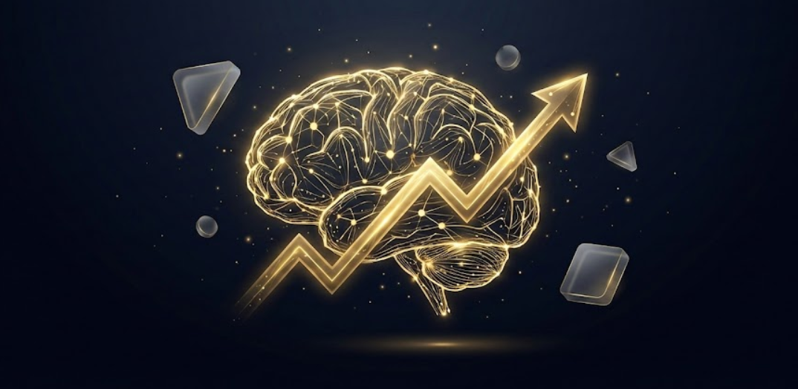
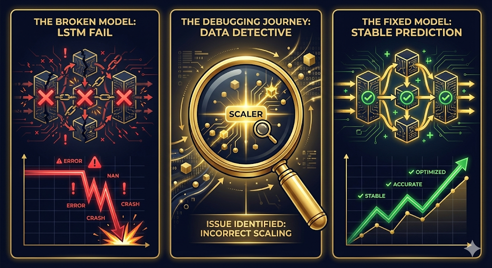

[](https://git.io/typing-svg)


<!-- 🔗 STREAMLIT APP LINK — COMING SOON -->
<p align="center">
  <a href="#">
    
  </a>
  <a href="https://github.com/mayank-goyal09">
    
  </a>
</p>

---

## 🎭 **THE GOLD ORACLE AWAITS** 🎭

<p align="center">
  
</p>

<p align="center">
  <b>🏆 Predict the future of gold with the power of Deep Learning! 🏆</b>
</p>

### 🔥 LSTM Neural Networks × Smart Data Strategy × Premium Glassmorphism UI = **Gold Price Oracle** 🔥


## 📖 **THE STORY — A Journey of Discovery** 📖

<p align="center">
  
</p>

This isn't just another ML project. **This is a war story.** A tale of a model that lied, a scaler that betrayed us, and the debugging marathon that saved everything.

### 🎬 **Act 1: The Perfect Plan** *(What We Expected)*

We started with a clear vision:

> *"Take 11 years of gold price data (2014-2025), train an LSTM, predict the next 30 days. Simple, right?"*

- ✅ Downloaded historical gold price data (2,848 data points)
- ✅ Built an LSTM model with 128 → 64 neurons
- ✅ Trained for 300 epochs with early stopping
- ✅ Hit "predict"... and everything fell apart 💀

---

### 💥 **Act 2: The Catastrophe** *(When Everything Broke)*

The first prediction came in. We stared at the screen in disbelief:

```
Last Actual Price:  ₹77,149  (Jan 2025)
Model Prediction:   ₹25,000  😱
```

**The model was predicting prices from 2015!** Gold was at ₹77,000 and our "intelligent" AI was confidently saying ₹25,000.

<table>
<tr>
<td width="50%" align="center">

### ❌ **What We Expected**

```
₹77,149 → ₹77,500 → ₹78,000
(Slight upward trend)
```

</td>
<td width="50%" align="center">

### 💀 **What We Got**

```
₹77,149 → ₹60,000 → ₹25,000
(Falling off a cliff!)
```

</td>
</tr>
</table>

---

> *"The model kept predicting ₹25,000 when gold was at ₹77,000. This is the story of how we figured out why — and fixed it."*

---
