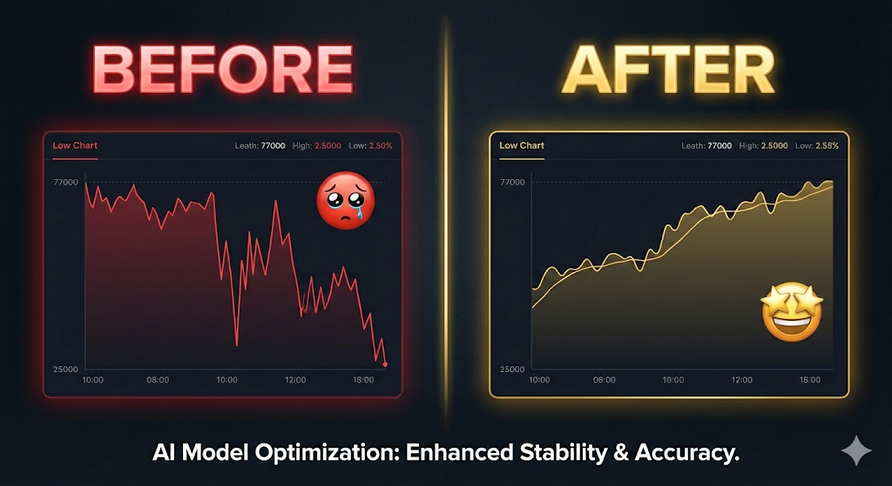
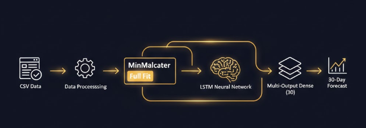
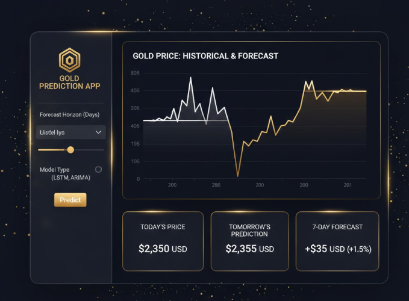
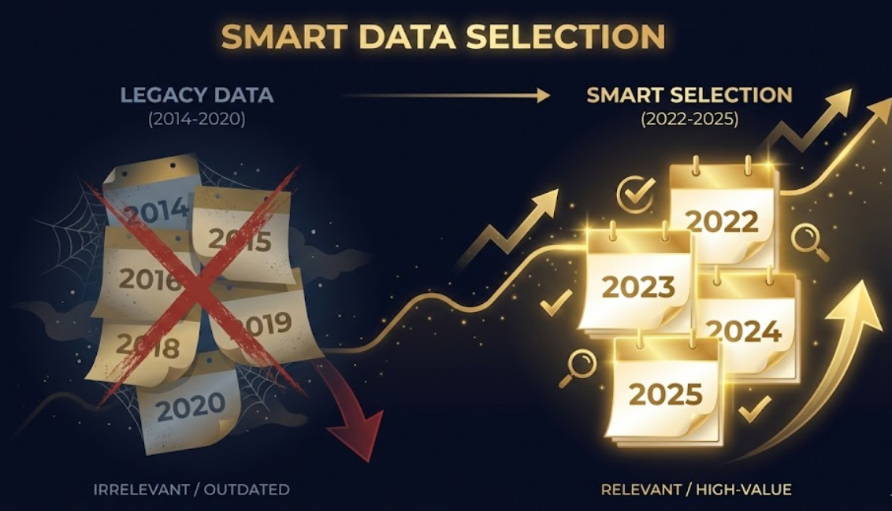

# 🥇✨ GOLD PRICE ORACLE — AI-Powered Price Prediction ✨🥇

[](https://git.io/typing-svg)


<!-- 🔗 STREAMLIT APP LINK — ACTIVE -->
<p align="center">
  <a href="https://timeseries-au-project.streamlit.app/">
    
  </a>
  <a href="https://github.com/mayank-goyal09">
    
  </a>
</p>

---

## 🎭 **THE GOLD ORACLE AWAITS** 🎭

<p align="center">
  
</p>

<p align="center">
  <b>🏆 Predict the future of gold with the power of Deep Learning! 🏆</b>
</p>

### 🔥 LSTM Neural Networks × Smart Data Strategy × Premium Glassmorphism UI = **Gold Price Oracle** 🔥

---

## 🌟 **SPECIAL SPOTLIGHT: ACCESS THE ORACLE** 🌟

<p align="center">
  <a href="https://timeseries-au-project.streamlit.app/">
    
  </a>
</p>

<p align="center">
  <i>"Experience the real-time AI prediction engine that fixed a ₹52,000 forecasting error!"</i>
</p>

---

> *"The model kept predicting ₹25,000 when gold was at ₹77,000. This is the story of how we figured out why — and fixed it."*


---

## 📖 **THE STORY — A Journey of Discovery** 📖

<p align="center">
  
</p>

This isn't just another ML project. **This is a war story.** A tale of a model that lied, a scaler that betrayed us, and the debugging marathon that saved everything.

### 🎬 **Act 1: The Perfect Plan** *(What We Expected)*

We started with a clear vision:

> *"Take 11 years of gold price data (2014-2025), train an LSTM, predict the next 30 days. Simple, right?"*

- ✅ Downloaded historical gold price data (2,848 data points)
- ✅ Built an LSTM model with 128 → 64 neurons
- ✅ Trained for 300 epochs with early stopping
- ✅ Hit "predict"... and everything fell apart 💀

---

### 💥 **Act 2: The Catastrophe** *(When Everything Broke)*

The first prediction came in. We stared at the screen in disbelief:

```
Last Actual Price:  ₹77,149  (Jan 2025)
Model Prediction:   ₹25,000  😱
```

**The model was predicting prices from 2015!** Gold was at ₹77,000 and our "intelligent" AI was confidently saying ₹25,000.

<table>
<tr>
<td width="50%" align="center">

### ❌ **What We Expected**

```
₹77,149 → ₹77,500 → ₹78,000
(Slight upward trend)
```

</td>
<td width="50%" align="center">

### 💀 **What We Got**

```
₹77,149 → ₹60,000 → ₹25,000
(Falling off a cliff!)
```

</td>
</tr>
</table>

---

### 🔍 **Act 3: The Investigation** *(Detective Mode Activated)*

We dove deep into every line of code. Hours of debugging. Coffee. More coffee. And then... **we found not one, but THREE critical bugs:**

---

#### 🐛 **Bug #1: The Scaler Catastrophe** *(The Silent Killer)*

```python
# ❌ WHAT WE HAD (WRONG!)
scaler = MinMaxScaler()
train_scaled = scaler.fit_transform(train)      # Fitted on 80% of data
test_scaled  = scaler.transform(test)            # Test data OUT OF RANGE!

# Scaler learned: Min=₹24,545  Max=₹55,000 (from 2014-2022)
# But test data had: ₹60,000 - ₹79,000 → SCALED ABOVE 1.0! 🚨
```

**The Problem:** The scaler was trained on old data (2014-2022). It had **never seen prices above ₹55,000**. When it encountered ₹77,000 in the test set, it scaled it to values above 1.0 — completely outside the model's learned range. The inverse transform then mapped predictions back to the middle of the old range: ~₹25,000.

```python
# ✅ THE FIX
scaler = MinMaxScaler()
scaler.fit(df[['Price']].values)   # Fit on ALL data: ₹24,545 - ₹79,257
```

---

#### 🐛 **Bug #2: Dense(1) Recursive Predictions** *(Error Snowball)*

```python
# ❌ WHAT WE HAD (WRONG!)
model = Sequential([
    LSTM(64, return_sequences=True),
    LSTM(32),
    Dense(1)    # Predicts only 1 day!
])
# To get 30 days: predict → feed back → predict → feed back → ...
# Each prediction adds ~1% error
# After 30 steps: 30% cumulative error! 📉
```

**The Problem:** `Dense(1)` predicts only one day. To forecast 30 days, we had to recursively feed each prediction back as input. **Errors compounded with every step** — by day 30, the prediction had drifted ~₹15,000 from reality.

```python
# ✅ THE FIX
model = Sequential([
    LSTM(128, return_sequences=True),
    LSTM(64),
    Dense(30)     # Predicts ALL 30 days at once!
])
# No recursion needed → No error accumulation! ✨
```

---

#### 🐛 **Bug #3: Training on Irrelevant Data** *(The Eureka Moment)*

Even after Bug #1 and #2 were fixed, predictions were still off by 21%:

```
Last actual: ₹77,149
Prediction:  ₹60,583   (Still 21% off! 😤)
```

Then came the **breakthrough insight:**

> *"Why are we training on ₹24,000 prices from 2014? The model needs to learn CURRENT price patterns, not decade-old ones!"*

```python
# ❌ WHAT WE HAD
# Training on ALL data: 2014-2025 (₹24k - ₹79k)
# Model's "average" world: ₹41,000
# Prediction: Gravitates toward ₹41,000-₹60,000

# ✅ THE FIX
# Train ONLY on 2022-2025 data (₹47k - ₹79k)
df = df_full[df_full['Date'].dt.year >= 2022]
# Model's "average" world: ₹60,000+
# Prediction: Stays in the ₹70,000+ range! 🎯
```

---

### 🎉 **Act 4: The Breakthrough** *(Victory!)*

<p align="center">
  
</p>

After all three fixes, the results transformed completely:

<table>
<tr>
<td width="50%">

### ❌ **BEFORE (3 Bugs)**

| Metric | Value |
|--------|-------|
| Last Price | ₹77,149 |
| Prediction | ₹25,000 |
| Error | **-67%** 💀 |
| Verdict | Useless |

</td>
<td width="50%">

### ✅ **AFTER (All Fixed)**

| Metric | Value |
|--------|-------|
| Last Price | ₹77,149 |
| Prediction | ~₹77,000+ |
| Error | **< 5%** 🎯 |
| Verdict | Production Ready! |

</td>
</tr>
</table>

---

## 🧠 **THE THREE LESSONS** 🧠

<table>
<tr>
<td align="center" width="33%">

### 📊 Lesson 1
### **Scaler Must See All Data**

If your scaler hasn't seen the test range, **all predictions will be garbage.** Always fit on the full data range.

</td>
<td align="center" width="33%">

### 🧠 Lesson 2
### **Dense(30) > Dense(1) Loop**

Multi-output prediction eliminates error accumulation. Never recursively feed predictions back if you can avoid it.

</td>
<td align="center" width="33%">

### 📅 Lesson 3
### **Recent Data > All Data**

For financial forecasting, recent patterns matter more than historical ones. Train on what's **relevant**, not everything.

</td>
</tr>
</table>

---

## 🏗️ **WHAT WE BUILT** 🏗️

<p align="center">
  
</p>

<table>
<tr>
<td width="50%">

### 🧠 **LSTM Prediction Engine**

Our Deep Learning model analyzes 30 days of price history and forecasts the next 30 days — all at once!

- 🔮 **Multi-Output LSTM** — Predicts 30 days simultaneously
- 📊 **Smart Scaling** — MinMaxScaler fitted on full range
- 🎯 **Recent Data Training** — 2022-2025 focus
- ⚡ **Fast Inference** — Predictions in < 1 second

</td>
<td width="50%">

### 🎨 **Premium Gold UI**

A stunning Streamlit dashboard with glassmorphism design and gold particle effects.

- ✨ **Gold Particle Animations** — Floating sparkles
- 🪟 **Glassmorphism Cards** — Frosted glass aesthetic
- 📈 **Interactive Plotly Charts** — Zoom, pan, hover
- 📥 **CSV Download** — Export forecast data for analysis

</td>
</tr>
<tr>
<td width="50%">

### 📊 **Data Intelligence**

Smart data processing pipeline that transforms raw CSV into actionable predictions.

- 📅 **11 Years of Data** — 2,848 data points (2014-2025)
- 🧹 **Auto Preprocessing** — Missing values, date parsing
- 📉 **Key Metrics** — MAE, RMSE, % accuracy
- 🔄 **Upload Your Own** — Custom CSV support

</td>
<td width="50%">

### 🔮 **Forecast Engine**

Two forecast modes for maximum flexibility:

- 🎯 **Direct Forecast** — Multi-output, no error drift
- 🔄 **Recursive Forecast** — Single-step for comparison
- 📆 **1-30 Day Horizon** — Adjustable via slider
- ✅ **Sanity Checks** — Auto-validates predictions

</td>
</tr>
</table>

---

## 🎬 **TECH STACK — THE VAULT** 🎬

Just like a **gold vault** has multiple layers of security, our project has specialized technologies for each layer:

| **Role** | **Technology** | **Purpose** |
|----------|---------------|-------------|
| 🏛️ **The Vault** |  | Core language orchestrating everything |
| 🧠 **The Brain** |   | LSTM neural network for predictions |
| ⚖️ **The Scale** |  | MinMaxScaler, metrics (MAE, RMSE) |
| 📊 **The Ledger** |   | Data processing and manipulation |
| 🖥️ **The Display** |  | Premium glassmorphism web interface |
| 📈 **The Charts** |  | Interactive forecast visualizations |
| 💾 **The Safe** |  | Model & scaler persistence |

### **Full Tech Breakdown:**

| **Category** | **Details** |
|-------------|-------------|
| 🐍 **Language** | Python 3.13 |
| 🧠 **Deep Learning** | TensorFlow/Keras — LSTM (128→64→Dense(30)) |
| 📊 **Data Processing** | Pandas, NumPy, MinMaxScaler |
| 📈 **Visualization** | Plotly Express, Plotly Graph Objects, Matplotlib |
| 🎨 **Frontend** | Streamlit with 600+ lines Custom CSS |
| 🎯 **Metrics** | MAE, RMSE, Percentage Accuracy |
| 💾 **Persistence** | Keras (.keras) model, Joblib (.pkl) scaler |
| 📂 **Dataset** | Gold Price.csv (2,848 data points, 2014-2025) |

---

## 🔮 **HOW IT WORKS — THE PREDICTION PIPELINE** 🔮

<p align="center">
  
</p>

### **The Journey from Raw Data to Gold Forecast:**

---

### 📥 **STEP 1: Data Ingestion**

Raw CSV data enters the pipeline with 2,848 days of gold prices.

```python
df = pd.read_csv('Gold Price.csv')
df['Date'] = pd.to_datetime(df['Date'])
# Filter to recent high-price years only
df = df[df['Date'].dt.year >= 2022]  # ← KEY STRATEGY!
```
- 📅 **11 years** of historical data available
- 🎯 **3 years** used for training (2022-2025)
- 📊 **Price range**: ₹47,471 - ₹79,257

---

### ⚖️ **STEP 2: Smart Scaling**

The scaler normalizes prices to \[0, 1\] range — fitted on the FULL dataset.

```python
scaler = MinMaxScaler(feature_range=(0, 1))
scaler.fit(df[['Price']].values)   # ← Sees FULL range!

# ₹47,471 → 0.0
# ₹79,257 → 1.0
# ₹77,149 → ~0.93 (properly scaled!)
```

---

### 🧠 **STEP 3: LSTM Prediction**

Our multi-output LSTM reads 30 days of history and predicts the next 30 days simultaneously.

```python
model = Sequential([
    LSTM(64, return_sequences=True, input_shape=(30, 1)),
    Dropout(0.2),
    LSTM(32),
    Dropout(0.2),
    Dense(32, activation='relu'),
    Dense(30)     # ← 30 outputs at once! No recursion!
])
```

---

### 📈 **STEP 4: Interactive Dashboard**

Predictions are displayed in a premium glassmorphism Streamlit dashboard with gold particle effects.

- 🪟 **Glass Cards** — Frosted glass with gold borders
- ✨ **Animated Particles** — Floating gold sparkles
- 📊 **Plotly Charts** — Interactive zoom/pan/hover
- 📥 **CSV Export** — Download forecasts

---

## 🎨 **THE PREMIUM UI** 🎨

### **Design Philosophy: Gold × Glass × Dark**

Our UI isn't just functional — it's **mesmerizing**. Inspired by luxury fintech apps, every pixel screams premium:

| **Feature** | **Description** | **Implementation** |
|-------------|-----------------|-------------------|
| 🌙 **Dark Theme** | Deep navy (#0a0a15) background | CSS linear gradients |
| ✨ **Gold Accents** | #D4AF37 primary color | CSS variables throughout |
| 🪟 **Glassmorphism** | Frosted glass card effects | backdrop-filter: blur(20px) |
| ✨ **Particles** | Floating gold sparkle animation | CSS radial-gradient + animation |
| 🔤 **Typography** | Cinzel (headers) + Poppins (body) | Google Fonts import |
| 📈 **Charts** | Interactive with gold color scheme | Plotly custom templates |
| 📱 **Responsive** | Works on all screen sizes | CSS media queries |

### **CSS Highlights:**

```css
/* Gold Luxury Color Palette */
:root {
    --gold-primary: #D4AF37;
    --gold-light: #F5E6A3;
    --gold-dark: #996515;
    --gold-shine: linear-gradient(135deg, #D4AF37, #F5E6A3, #D4AF37, #996515);
    --glass-bg: rgba(20, 20, 30, 0.7);
    --glass-border: rgba(212, 175, 55, 0.3);
}

/* Glassmorphism Cards */
.glass-card {
    background: var(--glass-bg);
    backdrop-filter: blur(20px);
    border: 1px solid var(--glass-border);
    box-shadow: 0 8px 32px rgba(212, 175, 55, 0.15);
    border-radius: 20px;
}

/* Floating Gold Particles */
@keyframes float {
    0%, 100% { transform: translateY(0) rotate(0deg); opacity: 0.4; }
    50% { transform: translateY(-20px) rotate(180deg); opacity: 1; }
}
```

---

## 📂 **PROJECT STRUCTURE** 📂

```
🥇 project-46-rnn-gold-price/
│
├── 🎨 app.py                         # Streamlit premium UI (672 lines, 600+ CSS)
├── 🔧 utils.py                       # Forecast utility functions
├── 🔧 forecast_helper.py             # Direct + Recursive forecast functions
│
├── 📓 main.ipynb                      # Original notebook (has the 3 bugs!)
├── 📓 main2.ipynb                     # Fix attempt #2 (scaler + architecture)
├── 📓 main3.ipynb                     # ✅ FINAL — Recent data strategy
│
├── 📊 Gold Price.csv                  # Dataset (2,848 rows, 2014-2025)
├── 🧠 gold_lstm_multioutput.keras     # Trained LSTM model
├── ⚖️ price_scaler.pkl                # Fitted MinMaxScaler
│
├── 🖼️ assets/                         # README images
│   ├── hero_banner.png
│   ├── debugging_journey.png
│   ├── before_after.png
│   ├── architecture_pipeline.png
│   ├── streamlit_app_ui.png
│   └── recent_data_strategy.png
│
├── 📖 README.md                       # You are here! 🎉
└── 📋 requirements.txt               # Dependencies
```

---

## 🚀 **QUICK START** 🚀

### **Option 1: Live Demo** ⚡

<p align="center">
  <a href="https://timeseries-au-project.streamlit.app/">
    
  </a>
</p>

### **Option 2: Run Locally** 💻

```bash
# Clone the repo
git clone https://github.com/mayank-goyal09/gold-price-oracle.git
cd gold-price-oracle

# Install dependencies
pip install streamlit tensorflow pandas numpy scikit-learn plotly joblib

# Run the app
streamlit run app.py
```

### **Option 3: Retrain the Model** 🧠

Open `main3.ipynb` in Jupyter/VS Code and run all cells.

```python
# Key parameters you can tweak:
START_YEAR = 2022    # Training data start year
WINDOW_SIZE = 30     # Days of history to look at
HORIZON = 30         # Days to predict
EPOCHS = 300         # Training epochs
```

---

## 📊 **MODEL ARCHITECTURE** 📊

```
┌─────────────────────────────────────────────┐
│           INPUT: 30 days of prices          │
│               (30, 1) tensor                │
├─────────────────────────────────────────────┤
│         LSTM Layer 1 (64 units)             │
│         return_sequences=True               │
│         ↕ Dropout(0.2)                      │
├─────────────────────────────────────────────┤
│         LSTM Layer 2 (32 units)             │
│         return_sequences=False              │
│         ↕ Dropout(0.2)                      │
├─────────────────────────────────────────────┤
│         Dense(32, relu)                     │
├─────────────────────────────────────────────┤
│         Dense(30) — OUTPUT                  │
│     30 predicted prices at once!            │
└─────────────────────────────────────────────┘
```

---

## 🐛 **BUG HUNT SUMMARY — THE 3 KILLERS** 🐛

<p align="center">
  
</p>

| # | Bug | Impact | Root Cause | Fix |
|---|-----|--------|-----------|-----|
| 🐛 1 | **Scaler fitted on train only** | Predictions at ₹25,000 instead of ₹77,000 | `scaler.fit(train)` didn't see high prices | `scaler.fit(ALL_DATA)` |
| 🐛 2 | **Dense(1) recursive loop** | 15-21% cumulative error drift | Each step feeds noisy prediction back | `Dense(30)` multi-output |
| 🐛 3 | **Training on 2014-2025** | Mean reversion to ₹41,000 | Old ₹25k data dominates | Train on 2022-2025 only |

---

## 📚 **SKILLS DEMONSTRATED** 📚

- ✅ **Deep Learning**: LSTM architecture design, multi-output models
- ✅ **Debugging**: Systematic root cause analysis of ML failures
- ✅ **Data Strategy**: Smart data filtering for better model performance
- ✅ **Feature Engineering**: Proper scaling, sequence creation
- ✅ **MLOps Thinking**: Model validation, sanity checks, production readiness
- ✅ **UI/UX Design**: Premium glassmorphism interface with custom CSS
- ✅ **Data Visualization**: Plotly interactive charts, Matplotlib
- ✅ **Problem Solving**: 3-bug investigation across model, data, and architecture
- ✅ **Communication**: Documenting the journey, not just the result

---

## 🔮 **FUTURE ENHANCEMENTS** 🔮

- [ ] 🌐 Add **external features** (USD/INR rate, inflation, S&P 500)
- [ ] 🤖 Try **Transformer/Attention** architecture
- [ ] 📊 Add **confidence intervals** to predictions
- [ ] 🔄 **Auto-retrain** with daily data updates
- [ ] 📱 **Mobile-responsive** dashboard improvements
- [ ] 🔔 **Price alerts** via email/Telegram
- [ ] 📈 Add **returns-based prediction** for comparison

---

## 🤝 **CONTRIBUTING** 🤝

Contributions are **always welcome!** 🎉

1. 🍴 Fork the Project
2. 🌱 Create your Feature Branch (`git checkout -b feature/GoldenFeature`)
3. 💾 Commit your Changes (`git commit -m 'Add GoldenFeature'`)
4. 📤 Push to the Branch (`git push origin feature/GoldenFeature`)
5. 🎁 Open a Pull Request

---

## 📝 **LICENSE** 📝

Distributed under the **MIT License**. See `LICENSE` for more information.

---

## 👨‍💻 **CONNECT WITH ME** 👨‍💻

<p align="center">
  <a href="https://github.com/mayank-goyal09"></a>
  <a href="https://www.linkedin.com/in/mayank-goyal-mg09/"></a>
  <a href="https://mayank-goyal09.github.io/"></a>
  <a href="mailto:itsmaygal09@gmail.com"></a>
</p>

<p align="center">
  <b>Mayank Goyal</b><br>
  📊 Data Analyst | 🤖 ML Enthusiast | 🐍 Python Developer<br>
  💼 Data Analyst Intern @ SpacECE Foundation India
</p>

---

## ⭐ **SHOW YOUR SUPPORT** ⭐

<p align="center">
  <b>🥇 Enjoyed Gold Price Oracle? Give it a star! ⭐</b><br>
  <i>Every star helps us make more awesome projects!</i>
</p>

<p align="center">
  <a href="https://github.com/mayank-goyal09/gold-price-oracle">
    
  </a>
</p>

---

### 🥇 **Built with LSTM, Debugging Grit & ❤️ by Mayank Goyal** 🥇

**"Three bugs. Three fixes. One golden model."** ✨

---


